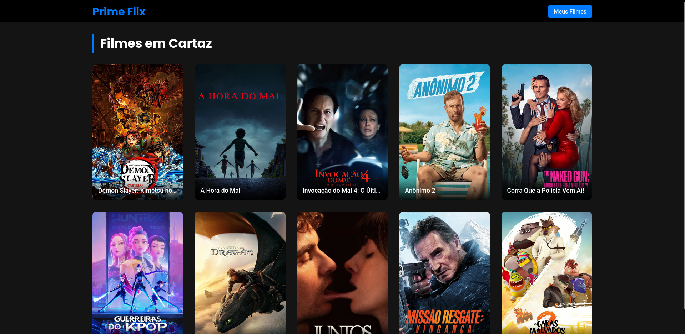

# 🎬 CinePosters - Catálogo de Filmes em Cartaz no Cinema

Um site moderno e responsivo construído com React para explorar uma lista de filmes que estão em cartaz no momento. Cada filme é apresentado em um card interativo, com a opção de ver detalhes, salvar nos favoritos e assistir ao trailer.

## ✨ Demonstração (Preview)




---

## 🚀 Funcionalidades

- **Listagem de Filmes em Cartaz:** Navegue por uma grade com os filmes mais recentes.
- **Página de Detalhes:** Acesse uma página dedicada para cada filme com sinopse, avaliação e outras informações.
- **Salvar Filmes Favoritos:** Adicione e remova filmes de uma lista de favoritos que fica salva no seu navegador (`localStorage`).
- **Notificações:** Receba feedback visual ao salvar ou remover um filme.
- **Link para o Trailer:** Acesse uma busca no YouTube pelo trailer do filme diretamente da página de detalhes.
- **Página de Erro:** Uma página amigável para rotas não encontradas.

---

## 🛠️ Tecnologias Utilizadas

Este projeto foi desenvolvido com as seguintes tecnologias:

- **React:** Biblioteca para construção da interface de usuário.
- **Create React App:** Ambiente de desenvolvimento para aplicações React.
- **React Router DOM:** Para gerenciamento das rotas da aplicação.
- **Axios:** Para realizar as requisições à API de filmes.
- **React Toastify:** Para exibir notificações ao usuário.
- **CSS Puro:** Para estilização dos componentes.
- **The Movie Database (TMDb) API:** Para obtenção dos dados dos filmes.

---

## 📦 Instalação e Uso

Siga os passos abaixo para executar o projeto em seu ambiente local.

**Pré-requisitos:**

- [Node.js](https://nodejs.org/en/) (versão LTS recomendada)
- [Git](https://git-scm.com/)

**Passo a passo:**

1.  **Clone o repositório:**

    ```bash
    git clone https://github.com/jotalucasfarias/primeflix.git
    ```

2.  **Acesse a pasta do projeto:**

    ```bash
    cd primeflix
    ```

3.  **Instale as dependências:**

    ```bash
    npm install
    ```

4.  **Configure as variáveis de ambiente:**

    - Crie um arquivo chamado `.env` na raiz do projeto.
    - Adicione sua chave da API do TMDb a este arquivo, como no exemplo abaixo:

    ```properties
    // filepath: .env
    REACT_APP_API_KEY=SUA_CHAVE_DA_API_AQUI
    ```

5.  **Execute a aplicação:**

    ```bash
    npm start
    ```

6.  Abra seu navegador e acesse `http://localhost:3000` (ou a porta indicada no terminal).

---

## 📄 Licença

Este projeto está sob a licença MIT.

---

## 👤 Autor

**João Lucas Farias da Silva**

- 📧 **Email:** jotalucasfarias@gmail.com
- 🌐 **GitHub:** [@jotalucasfarias](https://github.com/jotalucasfarias)
- 💼 **LinkedIn:** [linkedin.com/in/jottalucasfarias](https://www.linkedin.com/in/jottalucasfarias/)
